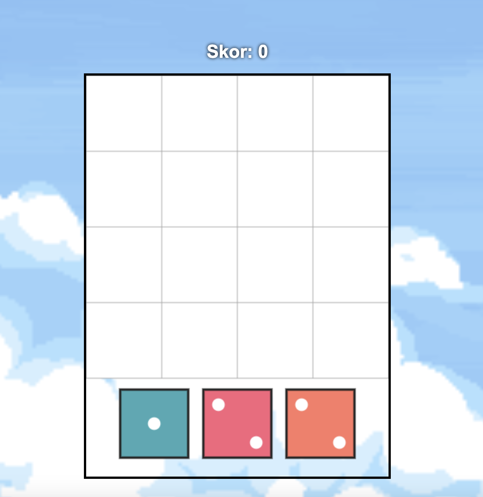
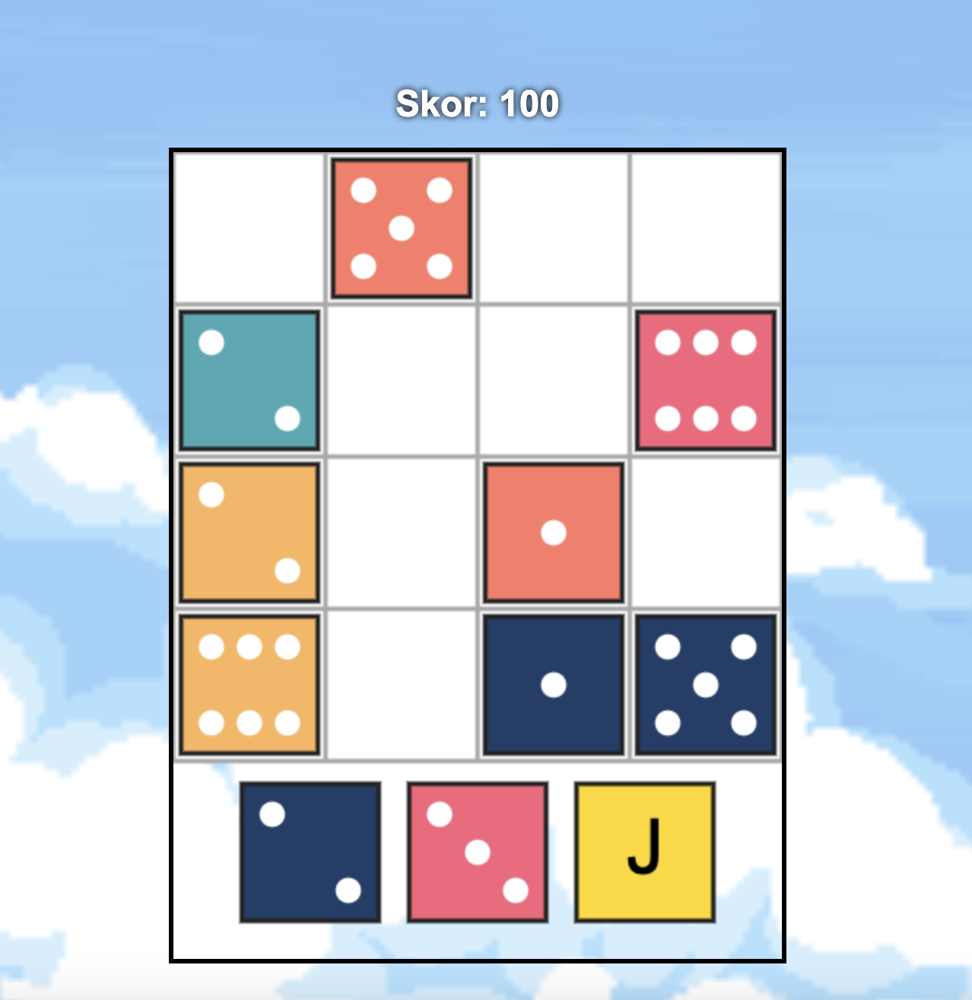

# 🎲 Dice with Kali

Bu proje, HTML5 Canvas ve JavaScript kullanılarak geliştirilen basit bir zar yerleştirme oyunudur. Amaç, 4x4’lük grid'e gelen zarları stratejik olarak yerleştirip satır ve sütunları doldurarak puan kazanmaktır.

## 🎮 Nasıl Oynanır?

- Her turda 3 rastgele zar üretilir.
- Zarları mouse ile sürükleyip 4x4’lük alana yerleştirirsiniz.
- Bir satır veya sütun tamamen dolduğunda temizlenir ve puan kazanırsınız.
- Grid'de zarların yerleşebileceği yer kalmadığında oyun sona erer.

## 📺 Oynanış Videosu

Oyunun 1 dakikalık kısa tanıtım videosunu aşağıdan izleyebilirsiniz:  
🔗 [YouTube Videosu](https://youtu.be/D5ekJwTa-hY)

## 🖼️ Oyun Görselleri

### Başlangıç Ekranı  

### Oyun İçinden Görüntü 

## 🔗 Canlı Demo

Oyunu tarayıcınızda hemen deneyebilirsiniz:  
👉 [Oyunu Oyna](https://selenyakin.github.io/dice-with-s/)

## 🛠️ Kullanılan Teknolojiler

- HTML5 Canvas
- JavaScript 
- CSS

